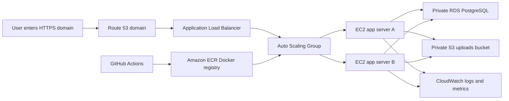

# Cloud Notes: Mid-Level DevOps AWS Assessment

This repository is a complete, cost-moderate answer to the assessment in `Mid-level DevOps Project (AWS) - FOR CANDIDATE.pdf`.

## Actual Requirement In Plain English

The project is not mainly asking for a complex application. It is asking you to prove that you can safely deploy a simple web app on AWS in a way that resembles a real production system.

The expected system must include:

1. A web application running on AWS compute.
2. A private database using Amazon RDS.
3. File storage using Amazon S3.
4. A VPC with public and private network areas.
5. Security groups that only allow the right traffic.
6. Secure environment configuration, not hard-coded passwords.
7. A CI/CD pipeline that tests, builds, and deploys automatically.
8. A load balancer and Auto Scaling Group.
9. Health checks so AWS can tell whether the app is alive.
10. CloudWatch logs, CPU/memory monitoring, and alerts.
11. A Route 53 domain and HTTPS certificate if a domain is available.
12. Documentation, an architecture diagram, setup steps, and a live URL if possible.

## What This Submission Builds

Cloud Notes is a small FastAPI web app. Users can:

- Add a note, which is saved in PostgreSQL on Amazon RDS.
- Upload a file, which is saved in a private S3 bucket.
- Open `/health`, which the load balancer uses to confirm the app is alive.
- Open `/ready`, which checks whether the app can reach the database.

## Architecture



## Folder Guide

- `app/`: FastAPI application.
- `tests/`: Basic health endpoint test.
- `Dockerfile`: Packages the app as a container.
- `.github/workflows/deploy.yml`: CI/CD pipeline.
- `terraform/`: AWS infrastructure as code.
- `docs/STEP_BY_STEP.md`: Detailed deployment explanation for non-technical readers.
- `docs/ARCHITECTURE.md`: Design choices and cost notes.
- `docs/DELIVERABLES_CHECKLIST.md`: Assessment requirement and bonus mapping.

## Cost-Moderate Defaults

The Terraform defaults use:

- `t3.micro` EC2 app servers.
- `db.t4g.micro` RDS PostgreSQL.
- 20 GB RDS storage.
- 2 app servers by default for availability.
- A single NAT Gateway to keep the app servers private.
- 14-day CloudWatch log retention.

For an assessment/demo, destroy the stack after review to avoid ongoing AWS charges:

```bash
cd terraform
terraform destroy
```

## Local Test

```bash
python -m venv .venv
. .venv/Scripts/activate
pip install -r requirements-dev.txt
pytest
```

## Deploy

Follow [docs/STEP_BY_STEP.md](docs/STEP_BY_STEP.md).
